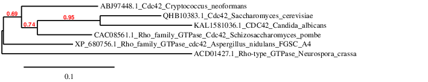
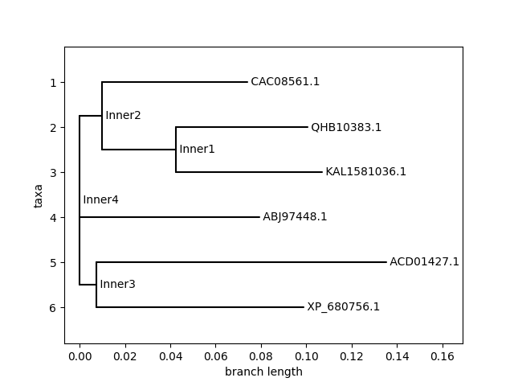

# Phylogenetic Analysis of Cdc42 in Fungi
<<<<<<< HEAD

## Project Overview

This project investigates the evolutionary conservation of Cdc42, a Rho-family GTPase involved in cell polarity and cytoskeleton organization. Protein sequences from multiple fungal species were compared to study evolutionary relationships.

---

## Methodology
=======
**Exploring the Evolutionary Conservation of Cell Polarity Regulators**

---

##  Project Overview
This project investigates the evolutionary history of **Cdc42**, a critical Rho-family GTPase that governs cell polarity and cytoskeleton organization. By performing a comparative phylogenetic analysis across diverse fungal species, we identify highly conserved functional domains essential for cell division.
>>>>>>> 9b5c70f0777eefd0a680240d1790b16326bd1770

### Data Collection

<<<<<<< HEAD
Initial sequence retrieval was attempted using Biopython. Due to inconsistencies in automated queries, sequences were manually curated from NCBI to ensure that only true Cdc42 proteins were included.
=======
##  Research Workflow
The analysis follows a rigorous 4-step computational pipeline:
>>>>>>> 9b5c70f0777eefd0a680240d1790b16326bd1770

### Multiple Sequence Alignment

<<<<<<< HEAD
Protein sequences were aligned using the MAFFT online tool to identify conserved regions across species.

### Phylogenetic Analysis (Tool-based)

A phylogenetic tree was constructed using Phylogeny.fr based on the aligned sequences.
=======
##  Tech Stack & Tools
| Tool | Purpose |
| :--- | :--- |
| **Python** | Scripting & Data Retrieval (Biopython) |
| **Bash** | Pipeline Automation & Shell Scripting |
| **MAFFT** | High-speed Sequence Alignment |
| **trimAl** | Automated Alignment Trimming |
| **IQ-TREE** | Maximum Likelihood Phylogeny |
| **iTOL** | Tree Visualization & Annotation |

##  Repository Structure
```text
├── fetch_sequences.py   # Python script for NCBI data mining
├── pipeline.sh          # Master bash script to run the bio-tools
├── README.md            # Project documentation
└── [Output Files]       # Alignment and Tree files (generated after run)
```

##  How to Reproduce
### 1. Prerequisites
Ensure you have the following installed:
*   Python 3.x (`pip install biopython`)
*   Conda (`conda install -c bioconda mafft trimal iqtree`)
>>>>>>> 9b5c70f0777eefd0a680240d1790b16326bd1770

### Phylogenetic Analysis (Python-based)

<<<<<<< HEAD
A second phylogenetic tree was generated using Python (Biopython) by calculating sequence distances and constructing a Neighbor Joining tree.
=======
# 1. Fetch sequences from NCBI
python fetch_sequences.py

# 2. Run the full alignment and tree pipeline
bash pipeline.sh
```

##  Expected Insights
The resulting phylogenetic tree (`.treefile`) reveals the divergence of Cdc42 across:
*   **Ascomycota** (e.g., *S. cerevisiae*, *N. crassa*)
*   **Basidiomycota** (e.g., *C. neoformans*, *P. graminis*)

High bootstrap values at internal nodes indicate a robust evolutionary signal, confirming Cdc42 as one of the most conserved proteins in the fungal kingdom.
>>>>>>> 9b5c70f0777eefd0a680240d1790b16326bd1770

---

## Results

* Cdc42 sequences are highly conserved (~190–200 amino acids)
* Strong sequence similarity observed across fungal species
* Phylogenetic trees show clustering of related organisms

---

## Phylogenetic Trees

### Tool-based Tree



### Python-based Tree



---

## Interpretation

The phylogenetic trees indicate that Cdc42 is highly conserved across fungal species. Closely related organisms cluster together, reflecting known evolutionary relationships. Similar clustering patterns in both approaches support the consistency of the analysis.

---

## Tools Used

* Python (Biopython)
* MAFFT (online)
* Phylogeny.fr

---

## Author

Pavithra Bandaru
Undergraduate Student, Biotechnology
